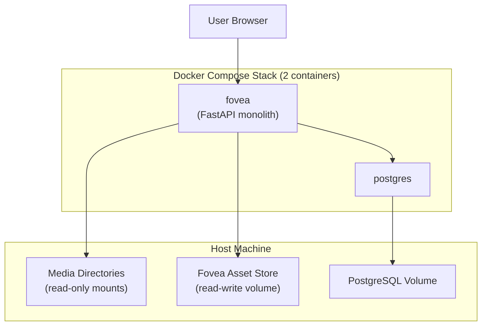
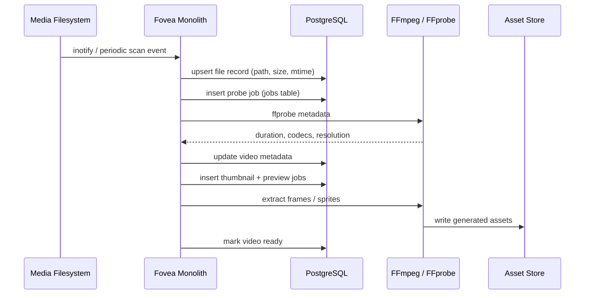
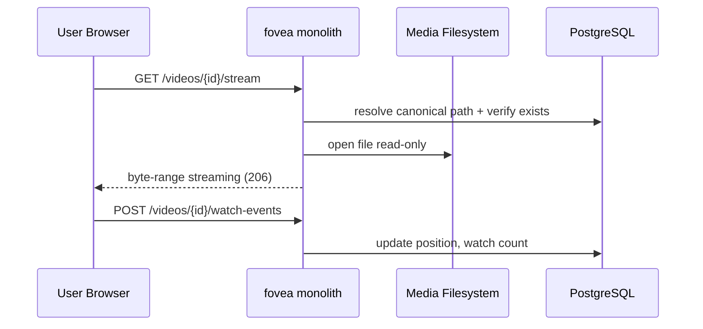
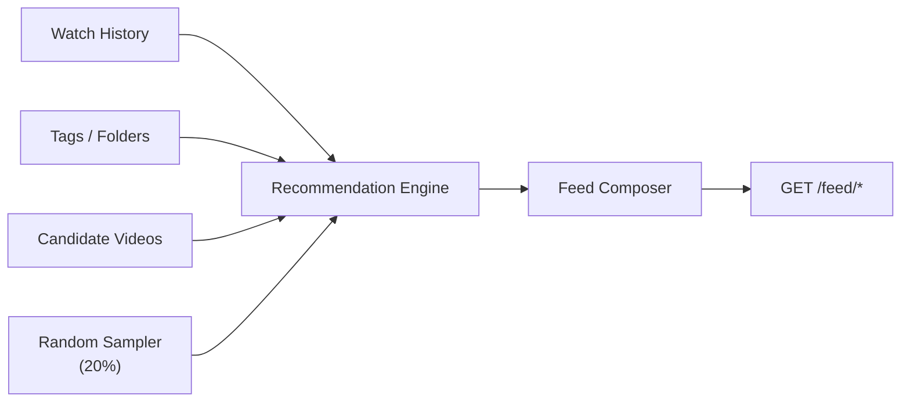

# Fovea — System Architecture

**Version:** 0.2 (Draft)  
**Status:** Planning  
**Last updated:** 2026-06-07

---

## 1. Architectural Principles

| Principle | Description |
|-----------|-------------|
| **Monolith-first** | Phase 1 runs as a single application process. No separate workers, queues, or sidecar services unless a demonstrated need arises. |
| **Minimal infrastructure** | PostgreSQL is the only required dependency beyond the app itself. No Redis, brokers, search engines, or vector DBs in Phase 1. |
| **Homelab-simple** | Optimize for self-hosters: fewer containers, fewer moving parts, easy `docker compose up`. |
| **Read-only media** | Source files are never modified. All writes go to application storage. |
| **Index in place** | The filesystem is scanned; nothing is copied into app storage. |
| **Metadata is the product** | PostgreSQL holds library state; videos stay on disk. |
| **Discovery-first API** | Endpoints optimize for feeds, recommendations, and search — not library administration. |
| **Docker-native** | Volumes and configuration assume containerized Linux deployment. |
| **Extensibility without rewrite** | Job pipelines, recommenders, and search are pluggable for future AI features — but not built until needed. |

---

## 2. High-Level System Context



### 2.1 Monolith Internal Modules

The `fovea` container runs one process with logically separated modules:

| Module | Responsibility |
|--------|----------------|
| **api** | REST endpoints; feed composition; byte-range streaming; metadata CRUD |
| **web** | Built React/TypeScript/Vite SPA served as static files |
| **watcher** | Directory monitoring; filesystem scans; file event handling |
| **jobs** | Background job processor; FFprobe and FFmpeg subprocess management |
| **postgres** (external) | Canonical metadata, watch history, job queue, scan state |

**Phase 1 constraint:** These modules run in-process. They are **not** separate containers or services.

### 2.2 Phase 1 Technology Stack

| Layer | Technology |
|-------|------------|
| Frontend | React + TypeScript + Vite |
| Backend | FastAPI |
| Database | PostgreSQL |
| Media | FFmpeg / FFprobe |
| Deployment | Docker Compose (`fovea` + `postgres`) |

**Not in Phase 1:** Redis, Celery/ARQ/RQ, Meilisearch, Elasticsearch, Qdrant, pgvector, separate nginx container.

---

## 3. Data Flow Overview

### 3.1 Library Ingestion (Folder Watching)



**Key decisions:**

- **Filesystem events + periodic reconciliation** — inotify (or `watchdog`) for responsiveness; scheduled full scan to catch missed events on network mounts.
- **Two-phase indexing** — fast file record first (visible in library quickly), enrichment jobs async (thumbnails, previews).
- **Idempotent jobs** — Re-running probe/preview for the same video overwrites assets in the asset store only.

### 3.2 Playback



**No transcoding in Phase 1.** The API streams the original file with `Accept-Ranges` support. Browser compatibility is an accepted Phase 1 limitation; unsupported codecs are surfaced clearly in the UI rather than transcoded.

### 3.3 Recommendations



The recommendation engine is a **swappable module** behind a stable interface:

```python
# Conceptual interface (not implementation)
class RecommendationProvider(Protocol):
    def recommend(
        self,
        context: RecommendationContext,
        limit: int,
        random_ratio: float = 0.2,
    ) -> list[RecommendedVideo]: ...
```

Future providers (embedding-based, LLM-ranked) implement the same interface.

---

## 4. Service Architecture

### 4.1 API Layer (FastAPI)

**Modules (proposed):**

| Module | Concerns |
|--------|----------|
| `videos` | CRUD, streaming, availability status |
| `feed` | Homepage sections, sidebar recommendations |
| `search` | Full-text and tag queries |
| `watch` | History, progress, events |
| `library` | Watch paths, scan status, manual rescan trigger |
| `assets` | Thumbnail and preview URLs (served from asset store) |
| `health` | Liveness, readiness, dependency checks |

**Cross-cutting:**

- Structured logging (JSON)
- Request ID middleware
- Path validation middleware (prevent directory traversal)
- CORS configured for dev; reverse proxy in production

### 4.2 Background Jobs (In-Process)

Background work runs inside the monolith as an asyncio task loop that polls the PostgreSQL `jobs` table. No external queue service.

**Job types:**

| Job | Trigger | Output |
|-----|---------|--------|
| `scan_path` | Startup, interval, manual | File inventory diff |
| `probe_video` | New/changed file | Duration, codecs, resolution in DB |
| `generate_thumbnail` | After probe | Poster image in asset store |
| `generate_preview_strip` | After probe | Seekbar preview sprites |
| `generate_hover_preview` | After probe (lower priority) | Card hover sprite |
| `reconcile_missing` | Scan diff | Mark videos unavailable |

**Phase 1 job queue decision:** PostgreSQL `jobs` table, polled by the monolith process.

| Approach | Phase 1 | Rationale |
|----------|---------|-----------|
| PostgreSQL `jobs` table | **Yes** | No extra infrastructure; survives restarts; good enough for homelab scale |
| In-memory asyncio queue only | No | Jobs lost on restart during initial scan |
| Redis / message broker | No | Adds operational complexity without demonstrated need |

**Concurrency:** Bounded FFmpeg subprocess pool (default 2) within the monolith. Scan and API remain responsive via async I/O.

### 4.3 Frontend (React + TypeScript + Vite)

**Page structure:**

| Route | Purpose |
|-------|---------|
| `/` | Homepage feed |
| `/watch/:id` | Video player + sidebar |
| `/search` | Search results |
| `/settings` | Watch paths, scan controls (admin) |

**State management:** React Query (TanStack Query) for server state; minimal client state for player position.

**Player:** Native `<video>` element with custom controls. Seekbar previews via pre-generated sprite sheets positioned with CSS.

---

## 5. Storage Architecture

### 5.1 Three Storage Domains

```
┌─────────────────────────────────────────────────────────────┐
│  DOMAIN 1: Source Media (READ-ONLY)                         │
│  User-owned paths mounted :ro into container                  │
│  Single source of truth for playback bytes                    │
└─────────────────────────────────────────────────────────────┘

┌─────────────────────────────────────────────────────────────┐
│  DOMAIN 2: Application Database (READ-WRITE)                │
│  PostgreSQL volume — metadata, history, jobs, config          │
└─────────────────────────────────────────────────────────────┘

┌─────────────────────────────────────────────────────────────┐
│  DOMAIN 3: Generated Assets (READ-WRITE)                    │
│  Thumbnails, preview frames, hover sprites                    │
│  Safe to delete and regenerate                                │
└─────────────────────────────────────────────────────────────┘
```

**Invariant:** Domains 2 and 3 never write into Domain 1.

### 5.2 Asset Store Layout (Proposed)

```
/data/fovea/assets/
  thumbnails/{video_id}.jpg
  previews/{video_id}/
    sprite.jpg
    sprite.vtt          # WebVTT for seekbar mapping
  hover/{video_id}/
    sprite.webp
    meta.json           # frame count, interval
```

Asset paths are referenced from DB; files are disposable.

### 5.3 Path Mapping

Host paths are mapped into the container:

```yaml
volumes:
  - /mnt/media/videos:/media/videos:ro
  - /media/archive:/media/archive:ro
```

The database stores **container-canonical paths only**. The application never stores or resolves host filesystem paths. Users map host directories to container paths via Docker volume mounts; Phase 1 watch path APIs persist the container paths in PostgreSQL.

**Decision (confirmed):** Container-canonical paths. See [ADR-006](./decisions.md#adr-006-store-container-canonical-paths-in-database).

---

## 6. Folder Watching Design

### 6.1 Watcher Strategy

Hybrid approach:

1. **Real-time** — `inotify` via Python `watchdog` on local filesystems
2. **Polling fallback** — For NFS/CIFS/some FUSE mounts where inotify is unreliable
3. **Scheduled reconciliation** — Full tree walk every N hours to catch drift

### 6.2 File Detection Rules

| Event | Action |
|-------|--------|
| New file matching video extensions | Insert record, enqueue probe |
| File removed | Mark `unavailable`; retain metadata for grace period |
| File modified (mtime/size change) | Re-probe, regenerate assets if needed |
| Rename detected | Update path on fingerprint match; preserve watch history |

### 6.3 Rename Detection Heuristic

Match deleted + added pairs within a scan window by:

1. File size (exact)
2. Duration from last known probe (if available)
3. Partial hash (first/last N MB) for high confidence

**Tradeoff:** Partial hashing reads source files but does not modify them. CPU and I/O cost during large reorganizations is accepted to reduce false rename matches.

**Decision:** Partial hash rename detection is enabled by default via `RENAME_DETECTION=partial_hash`. Operators may downgrade to `size_duration` if scan I/O is more important than rename confidence.

### 6.4 Ignore Rules

Support:

- Hardcoded ignores: `.*`, `*.part`, `*.tmp`, `@eaDir`, `#recycle`
- Configurable glob excludes: `**/samples/**`
- Future: `.foveaignore` per directory

---

## 7. Recommendation Engine Architecture

### 7.1 Phase 1: Metadata-Based Scorer

**Signals and weights (illustrative):**

| Signal | Weight | Notes |
|--------|--------|-------|
| Tag overlap with recently watched | High | Jaccard similarity |
| Same parent folder | Medium | Path prefix match |
| Filename token overlap | Low | Tokenized, stopword-filtered |
| Watch count inverse | Medium | Boost unwatched |
| Recency of add | Low | Freshness for "Recently Added" overlap |

**Random injection:**

- For each feed request, `ceil(limit * 0.2)` slots filled by uniform random from eligible pool
- Remaining slots filled by score-ranked candidates
- Shuffle or interleave to avoid predictable "random block" at end

### 7.2 Caching

**Phase 1:** No feed caching layer. Recommendation queries run against PostgreSQL directly. At homelab scale (up to ~50k videos), indexed queries are sufficient.

If performance becomes a demonstrated problem, caching may be added later (in-process LRU or an external store). Do not introduce Redis preemptively.

### 7.3 Future: Embedding Provider

```
RecommendationProvider
├── MetadataProvider (Phase 1)
├── EmbeddingProvider (Phase N)
└── HybridProvider (weighted ensemble)
```

Embedding index deferred to a future phase (pgvector column or dedicated store) — see [database.md](./database.md). Not part of Phase 1 stack.

---

## 8. Search Architecture

### 8.1 Phase 1: PostgreSQL Full-Text Search

- `tsvector` column on videos combining title, filename, tags
- GIN index for query performance
- Tag filter via join table

### 8.2 Future: Semantic Search

- Parallel `search_documents` or embedding table
- Search API accepts `mode=keyword|semantic|hybrid`
- Query router dispatches to appropriate backend

**API stability:** `GET /search?q=...` remains; `mode` parameter added later.

---

## 9. Security Architecture

### 9.1 Threat Model (Phase 1)

| Threat | Mitigation |
|--------|------------|
| Path traversal via video ID | Resolve ID → DB path; validate path under configured watch roots |
| Unauthorized access | No app-level auth Phase 1; reverse proxy auth if exposed beyond LAN |
| Container escape via FFmpeg | Run monolith as non-root; limit FFmpeg subprocess resources |
| Denial of service (large library scan) | Rate-limit scans; bounded worker concurrency |

### 9.2 Streaming Authorization

Even in single-user Phase 1, streaming endpoint validates:

1. Video exists in DB
2. Resolved path is under a configured watch root
3. File exists and is readable

---

## 10. Deployment Architecture

### 10.1 Docker Compose Topology

Phase 1 uses **two containers**:

```yaml
# Conceptual — not final compose file
services:
  postgres:
    volumes: [fovea-db:/var/lib/postgresql/data]

  fovea:
    depends_on: [postgres]
    ports: ["8080:8080"]
    volumes:
      - /mnt/media/videos:/media/videos:ro   # host → container mount
      - fovea-assets:/data/fovea/assets
    environment:
      DATABASE_URL: postgresql://...
      # Watch paths are stored in PostgreSQL via Phase 1 APIs.
      ASSETS_PATH: /data/fovea/assets
```

The `fovea` container serves:

- REST API at `/api/v1/*`
- Built React frontend at `/`
- Generated assets at `/api/v1/assets/*`
- Background watcher and job processor (same process)

### 10.2 Networking

- `fovea` exposed on a single host port (e.g., 8080)
- `postgres` on internal Docker network only (not exposed to host by default)
- Media mounts attached only to `fovea`
- Optional reverse proxy (Traefik, Caddy) in front — operator's choice, not a Fovea dependency

### 10.3 Health and Readiness

| Check | Endpoint |
|-------|----------|
| Process alive | `GET /health/live` |
| DB connected, migrations applied | `GET /health/ready` |
| Background tasks running | `background_last_seen` timestamp in DB, updated by monolith |

---

## 11. Extensibility Hooks (Future Features)

| Future feature | Hook location |
|----------------|---------------|
| Transcripts | `video_artifacts` table + `transcribe` job type |
| Scene detection | `video_scenes` table + `scene_detect` job |
| AI understanding | `video_analysis` JSONB + analyzer worker |
| Embeddings | `video_embeddings vector(1536)` + `EmbeddingProvider` |
| Semantic search | Search router + vector index |
| AI recommendations | `RecommendationProvider` implementation |

Jobs follow a common envelope:

```json
{
  "job_type": "probe_video",
  "video_id": "uuid",
  "payload": {},
  "priority": 10,
  "created_at": "ISO8601"
}
```

New job types extend the worker without changing the API contract.

---

## 12. Technology Stack (Phase 1)

| Layer | Choice | Rationale | Alternatives considered |
|-------|--------|-----------|-------------------------|
| Frontend | React + TS + Vite | Fast dev, strong ecosystem | SvelteKit (smaller ecosystem for video UI patterns) |
| Backend | FastAPI (monolith) | Async, OpenAPI, Python FFmpeg ecosystem | Separate microservices (rejected: ops complexity) |
| Database | PostgreSQL | FTS, JSONB, job queue, JSONB artifacts | SQLite (concurrent write limits) |
| Job queue | PostgreSQL `jobs` table | No extra service; sufficient for homelab | Redis + ARQ (rejected: unnecessary infra) |
| Media | FFmpeg / FFprobe | Industry standard | None — required for probe and previews |
| Deployment | Docker Compose | Two containers: `fovea` + `postgres` | Kubernetes (rejected: homelab overkill) |

**Explicitly deferred:** Redis, message brokers, Meilisearch/Elasticsearch, vector databases, separate worker containers.

---

## 13. Tradeoffs and Risks

| Risk | Likelihood | Impact | Mitigation |
|------|------------|--------|------------|
| Browser can't play codec | High | Playback fails | Document codec guidance; show unsupported-codec state; transcoding remains out of Phase 1 |
| NFS watcher misses events | Medium | Stale library | Polling + scheduled reconciliation |
| Large library scan I/O | Medium | Slow startup | Incremental scan; priority queue for new files |
| Rename detection false positives | Low | Wrong history attachment | Conservative matching; manual unlink in UI later |
| FFmpeg CPU spikes | Medium | Host contention | Concurrency limits; off-peak preview generation |
| No auth in Phase 1 | Medium | Open if exposed | Document reverse-proxy requirement prominently |

---

## 14. Open Questions

1. **WebSocket for scan progress?** Nice UX vs polling `/library/status`.
2. **Sidecar subtitle discovery?** Read `.srt` next to video without importing.
3. **Multi-library profiles?** Different watch paths per profile — affects DB schema (likely post-multi-user).
4. **GPU acceleration for FFmpeg?** Relevant only if transcoding added later.
5. **When to split the monolith?** Only if demonstrated need (e.g., FFmpeg blocking API at scale). Not a Phase 1 concern.

---

## 15. Related Documents

- [PRD](./prd.md)
- [Database Schema](./database.md)
- [API Specification](./api.md)
- [Implementation Phases](./phases.md)
- [Architecture Decision Records](./decisions.md)
