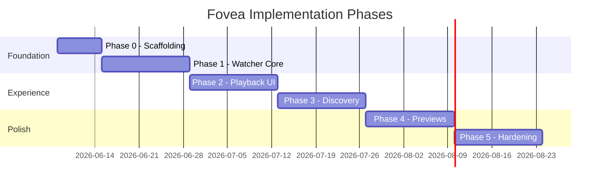
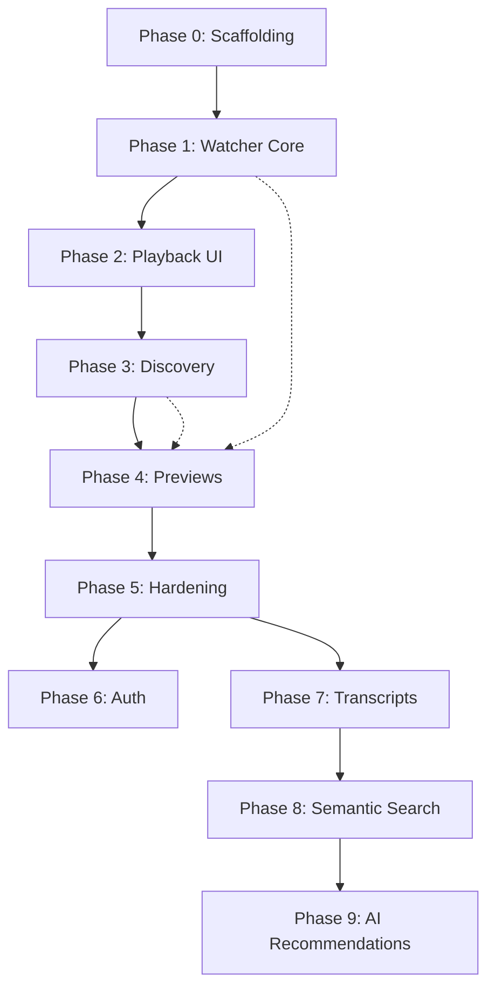

# Fovea — Implementation Phases

**Version:** 0.2 (Draft)  
**Status:** Planning  
**Last updated:** 2026-06-07

---

## 1. Phasing Philosophy

Fovea is built in layers that respect the non-negotiable constraints first (read-only media, folder watching, Docker deployment), then deliver the discovery experience, then enrich with previews and recommendation quality.

Each phase produces a **deployable, useful artifact**. No phase requires rewriting prior architectural decisions.

### 1.0 Monolith-First Constraint

All Phase 0–5 work targets a **single `fovea` container** plus `postgres`. Background tasks (watcher, job processor) run in-process. No Redis, message brokers, separate worker containers, or auxiliary services are introduced during Phase 1 unless a demonstrated requirement forces a reconsideration.

### 1.1 Guiding Priorities

1. **Folder watching works reliably** — without this, nothing else matters.
2. **Users can watch videos** — direct streaming from source.
3. **Discovery feels like YouTube** — feeds, history, recommendations, randomness.
4. **Polish differentiates** — seekbar previews, hover cards, search.

### 1.2 What We Explicitly Defer

- AI / embeddings / semantic search
- Transcoding
- Authentication, accounts, permissions, multi-user
- Redis, message brokers, dedicated search engines, vector databases
- Separate worker containers and microservice decomposition
- Native mobile apps
- TV show / movie hierarchy management

---

## 2. Phase Overview



Durations are estimates for planning, not commitments.

| Phase | Name | Outcome |
|-------|------|---------|
| 0 | Scaffolding | Docker Compose boots; DB migrates; health checks pass |
| 1 | Watcher Core | Videos auto-appear from configured paths |
| 2 | Playback UI | User can browse list and watch videos |
| 3 | Discovery | YouTube-like homepage, recommendations, search |
| 4 | Previews | Thumbnails, seekbar sprites, hover previews |
| 5 | Hardening | Production readiness, docs, performance |

---

## 3. Phase 0 — Scaffolding

**Goal:** Establish the project skeleton and deployment path. No user-facing features yet.

### 3.1 Deliverables

- [ ] Repository structure (`backend/`, `frontend/`, `docker/`)
- [ ] Docker Compose with **`fovea`** (monolith) + **`postgres`** only
- [ ] PostgreSQL volume persistence
- [ ] Alembic migrations baseline
- [ ] FastAPI health endpoints (`/health/live`, `/health/ready`)
- [ ] React + Vite + TypeScript app shell (built into monolith image)
- [ ] Monolith serves static frontend at `/` and API at `/api/v1`
- [ ] Environment variable configuration documented
- [ ] Read-only media volume mount pattern established
- [ ] Schema includes nullable/defaulted `user_id` columns (multi-user ready)

### 3.2 Technical Tasks

| Task | Owner module |
|------|--------------|
| SQLAlchemy models for `watch_paths`, `videos` (minimal) | backend |
| Compose file with named volumes (2 services) | docker |
| Dev hot-reload setup (Vite dev server + API separately in dev) | backend, frontend |
| `.env.example` with `WATCH_PATHS`, `DATABASE_URL`, `ASSETS_PATH` | docker |

### 3.3 Exit Criteria

- `docker compose up` starts **two containers** (`fovea`, `postgres`) without error
- `GET /health/ready` returns 200
- Frontend loads placeholder page at `http://localhost:8080/`
- No Redis, worker, or additional services in Compose file
- README documents quick-start (deferred to implementation; referenced here)

### 3.4 Risks

| Risk | Mitigation |
|------|------------|
| Over-engineering project structure | Minimal modules; expand when needed |
| Compose port conflicts | Document default ports; make configurable |

---

## 4. Phase 1 — Watcher Core (Highest Priority)

**Goal:** Configure watch paths; videos are discovered, probed, and stored automatically.

### 4.1 Deliverables

- [ ] `watch_paths` CRUD (API + DB)
- [ ] Initial directory scan on path add and startup
- [ ] Filesystem watcher (`watchdog`) with polling fallback
- [ ] Scheduled reconciliation scan (configurable interval)
- [ ] Video file detection (extension allowlist)
- [ ] FFprobe integration → `video_probe` table
- [ ] PostgreSQL `jobs` table + in-process job poller
- [ ] Detect removed files → `status = unavailable`
- [ ] Basic rename detection (size + mtime heuristic)
- [ ] Ignore rules for temp/partial files
- [ ] `GET /library/status` and `POST /library/scan`

### 4.2 Video Extension Allowlist (Proposed)

```
.mp4, .mkv, .webm, .avi, .mov, .m4v, .wmv, .flv, .mpeg, .mpg
```

**Open question:** Strict allowlist vs "probe everything"? Allowlist reduces noise.

### 4.3 Exit Criteria

- Add video file to mounted directory → appears in DB within 60s (local FS)
- Remove video file → marked unavailable within reconciliation window
- Rename video (same size) → same `video_id`, updated path
- No writes occur to media mount (verified by read-only flag)
- Scan of 1,000 files completes without blocking API

### 4.4 Tradeoffs

| Choice | Phase 1 decision | Later improvement |
|--------|------------------|-------------------|
| Monolith (watcher + jobs in-process) | **Yes** | Split only if demonstrated bottleneck |
| PostgreSQL job queue | **Yes** | External queue only if DB polling insufficient |
| Partial hash rename detection | Off by default | Configurable |
| Per-file scan events table | Skip | Add if debugging needed |

---

## 5. Phase 2 — Playback UI

**Goal:** Minimal but functional UI to list and watch videos.

### 5.1 Deliverables

- [ ] `GET /videos/{id}` detail endpoint
- [ ] `GET /videos/{id}/stream` with byte-range support
- [ ] Video list page (simple grid, sorted by `added_at`)
- [ ] Video page with HTML5 player
- [ ] Basic title display (auto from filename)
- [ ] Path validation and traversal protection
- [ ] Error states: unavailable, probe error, unsupported codec
- [ ] `PUT /watch/sessions/{video_id}` progress tracking
- [ ] Resume playback from last position

### 5.2 Exit Criteria

- User can click a video and watch it from source on LAN
- Seeking works via byte-range requests
- Refresh page resumes from last saved position
- Unavailable videos show clear message, don't 500

### 5.3 Known Limitations (Acceptable)

- No thumbnails yet (placeholder image)
- No homepage sections
- No search
- No tag editing

---

## 6. Phase 3 — Discovery

**Goal:** YouTube-like homepage, metadata recommendations, search, tags.

### 6.1 Deliverables

- [ ] Homepage with sections:
  - Continue watching
  - Recently added
  - Frequently watched
  - Recommended for you
  - Random discovery
- [ ] Metadata-based recommendation engine
- [ ] 20% random injection in recommendation feeds
- [ ] Recommendation sidebar on video page
- [ ] `GET /feed/home` and section endpoints
- [ ] Full-text search (`GET /search`)
- [ ] Tag CRUD on videos (`PATCH /videos/{id}`)
- [ ] Auto-tags from folder names
- [ ] `GET /tags` endpoint
- [ ] Watch history list
- [ ] Recommendation reason labels

### 6.2 Recommendation Engine (Phase 3 Scope)

**In scope:**

- Tag overlap scoring
- Folder path similarity
- Filename token overlap
- Watch history signals (recency, completion)
- Random slot injection (20%)
- Unwatched / low-watch-count boosting

**Out of scope:**

- ML models
- Embedding similarity
- Collaborative filtering across users (single-user anyway)

### 6.3 Exit Criteria

- Homepage loads all sections in < 2s for 5k video library (LAN)
- Recommendations change after watching videos in a tag category
- ~20% of recommended slots show "Random pick" reason
- Search finds videos by title and filename
- Tags editable and reflected in search

### 6.4 Proposed Improvements (If Time Permits)

- "Because you watched X" explainability strings
- Session-level deduplication (don't show same video twice on home)

---

## 7. Phase 4 — Previews and Generated Assets

**Goal:** Visual polish comparable to YouTube previews.

### 7.1 Deliverables

- [ ] Asset store volume and directory layout
- [ ] Thumbnail generation (poster frame at 10% duration or first keyframe)
- [ ] `video_assets` table population
- [ ] Asset serving endpoints with cache headers
- [ ] Seekbar preview sprite + WebVTT generation
- [ ] Player seekbar hover integration
- [ ] Hover preview sprites on video cards
- [ ] Job priority: thumbnail > preview sprite > hover sprite
- [ ] Regenerate assets on file change (mtime/size)

### 7.2 FFmpeg Job Concurrency

| Setting | Default |
|---------|---------|
| Max concurrent FFmpeg jobs | 2 |
| Preview frame interval | Every 10 seconds |
| Sprite columns | 10 |
| Hover preview frames | 30 frames over 5 seconds |

**Tradeoff:** Higher concurrency speeds indexing but can saturate CPU during initial scan.

### 7.3 Exit Criteria

- All `ready` videos have thumbnails within reasonable time (background)
- Seekbar hover shows preview frames on video player
- Card hover shows animated/sprite preview in homepage and sidebar
- Deleting asset store and restarting regenerates all assets without affecting source

### 7.4 Deferred to Phase 4.5+

- Muted autoplay hover clips (MP4/WebM)
- Multiple thumbnail candidates for user selection

---

## 8. Phase 5 — Hardening and Release

**Goal:** Production-ready self-hosted deployment.

### 8.1 Deliverables

- [ ] Structured JSON logging
- [ ] Graceful handling of offline media mounts
- [ ] Admin settings UI (watch paths, scan trigger, status dashboard)
- [ ] Performance indexes verified against EXPLAIN
- [ ] Security review: path traversal, FFmpeg sandboxing
- [ ] Docker image publishing (GHCR)
- [ ] User documentation: deployment, codec compatibility, backup strategy
- [ ] Backup guidance: DB + asset store (not source media)

### 8.2 Exit Criteria

- 24-hour soak test with 10k library: no memory leaks, no DB bloat anomalies
- Container restart recovers watcher and resumes jobs
- Documentation enables new user deploy in < 15 minutes
- All Phase 1 PRD success criteria met

---

## 9. Future Phases (Post-1.0)

### Phase 6 — Multi-User and Auth

- User accounts, sessions
- Per-user watch history and recommendations
- Admin vs viewer roles
- Native API authentication

### Phase 7 — Transcripts and Text Artifacts

- Whisper or similar transcript generation
- Transcript display on video page
- Full-text search over transcript content

### Phase 8 — Semantic Search and Embeddings

- pgvector or dedicated vector store
- Embedding generation pipeline
- `mode=semantic` search parameter
- Hybrid keyword + vector ranking

### Phase 9 — AI Recommendations

- Content embedding similarity
- LLM-generated summaries (optional)
- Scene detection artifacts

### Phase 10 — Optional Transcoding

**Architectural constraint preserved:** transcodes write to asset store only, never source.

- On-demand or pre-generated browser-compatible proxy files
- Codec compatibility detection and automatic proxy suggestion

---

## 10. Dependency Graph



Phase 4 depends on Phase 1 (probe metadata for timestamps) but UI integration depends on Phase 2 and 3.

---

## 11. Milestone Mapping to PRD

| PRD requirement | Phase |
|-----------------|-------|
| Source videos never modified | 0–5 (enforced throughout) |
| No media import | 1 |
| Folder watching | 1 |
| Docker-first | 0 |
| Read-only media mounts | 0 |
| Video-centric model | 1 |
| Homepage experience | 3 |
| Video page | 2, 3 |
| Metadata recommendations | 3 |
| 20% random discovery | 3 |
| Search | 3 |
| Seekbar preview | 4 |
| Card hover preview | 4 |
| Future AI hooks | 5 (docs), 7–9 (implementation) |

---

## 12. Testing Strategy (Per Phase)

| Phase | Testing focus |
|-------|---------------|
| 0 | Compose smoke test, health check CI |
| 1 | Integration: add/remove/rename files; assert DB state |
| 2 | E2E: play video, resume; stream range requests |
| 3 | Unit: recommendation scorer; integration: search FTS |
| 4 | Visual: sprite generation; player hover manual QA |
| 5 | Load: 10k library scan; soak test; security scan |

**Note:** Test implementation is deferred until coding begins. This section defines intent.

---

## 13. Resolved and Remaining Questions

### Resolved

| Question | Decision |
|----------|----------|
| Monolith vs microservices? | **Monolith** for Phase 1 |
| Redis / message broker? | **No** — PostgreSQL job queue only |
| Separate worker container? | **No** — in-process background tasks |
| Single-user vs multi-user? | **Single-user**; schema forward-compatible |
| Container vs host paths? | **Container-canonical paths only** |

### Remaining

| Question | Options |
|----------|---------|
| Continue watching in Phase 2 or 3? | Phase 2 if resume is priority; Phase 3 with homepage |
| Subtitle detection before previews? | Phase 2.5 or defer to Phase 6+ |

---

## 14. Related Documents

- [PRD](./prd.md)
- [Architecture](./architecture.md)
- [Database Schema](./database.md)
- [API Specification](./api.md)
- [Architecture Decision Records](./decisions.md)
